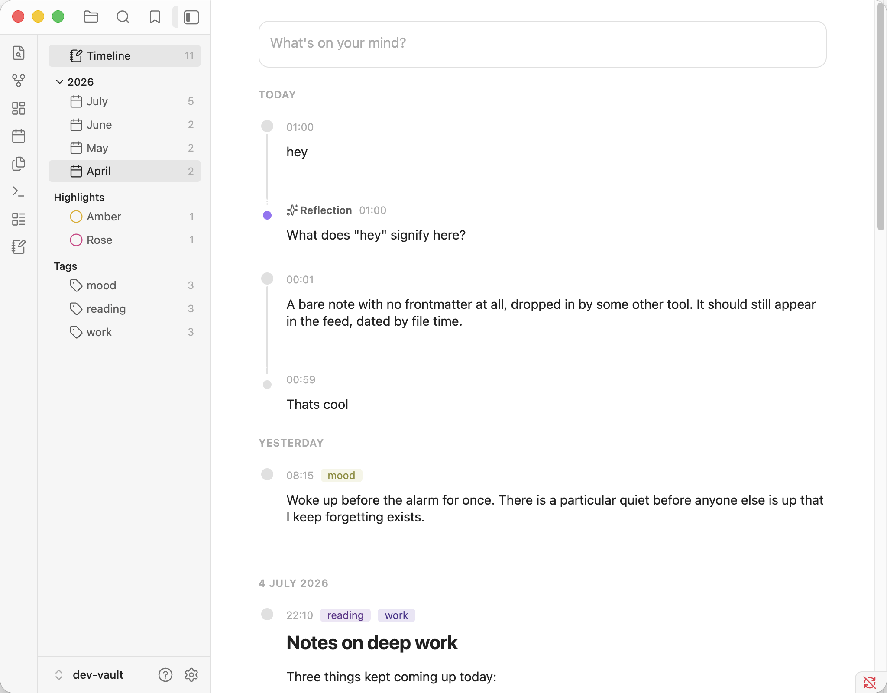

# Ripple



A micro-journal inside your Obsidian vault, in the spirit of [Pile](https://github.com/UdaraJay/pile) by Udara Jay: one folder of plain Markdown posts, a feed with a composer, threaded replies, highlights, and AI reflections. Local-first; the journal folder remains the only source of truth.

Ripple is an independent project inspired by Pile; it is not affiliated with or endorsed by Pile or Udara Jay.

- **One linked folder** (default `Ripple/`, changeable in settings): posts land as `YYYY/MM/YYYYMMDD-HHmmss.md` with a small frontmatter block. Files dropped in by any other route appear in the feed — the folder is the API.
- **Feed**: newest-first under day headers, composer pinned on top, a month scrubber on the edge. `n` focuses the composer, `Cmd/Ctrl-Enter` posts, `j`/`k` move, `Enter` edits in place, `r` replies, `h` cycles highlights, `t` names the note (files are timestamp-named until you choose otherwise), `o` opens the post as a normal note.
- **Threads**: replies nest under their post via `reply_to` wikilinks; renames never orphan a thread.
- **Reflections**: optional AI replies via the [AI Providers](https://github.com/pfrankov/obsidian-ai-providers) plugin — Ripple holds no API keys and talks to no provider directly. Reflections stream in and are saved (marked `ai: true`) only on completion; stopping one writes nothing. Without AI Providers everything else works and reflect stays disabled.
- **Navigation**: opening Ripple swaps the left sidebar to its own navigation — Timeline, months, highlights, tags — and gives the feed the whole pane; closing it restores your layout.

## Development

```
npm install
npm run fixtures   # seeds dev-vault/ with sample posts; copies the plugin in
npm run dev        # watch build
```

Open `dev-vault/` as a vault in Obsidian, turn off restricted mode, and enable Ripple. The dev vault ships with AI Providers preconfigured against a local Ollama (`qwen3:14b`). Never point the build at a real vault.
